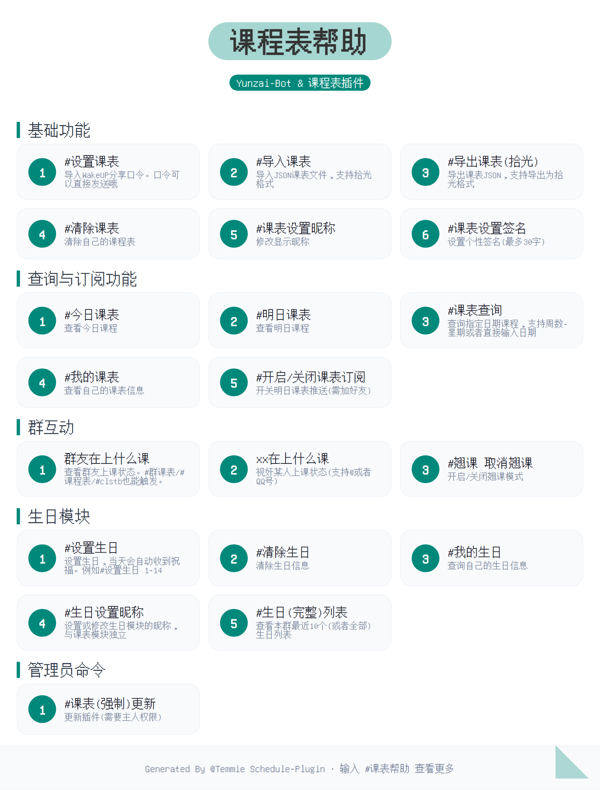

# 📅 Schedule 课程表插件

<p align="center">
  
  
  
  
  
</p>

## 简介

**Schedule 课程表插件** 是基于 [Yunzai-Bot V3](https://github.com/TimeRainStarSky/Yunzai) 的课程表管理插件。它支持通过 [WakeUP 课程表](https://www.wakeup.fun/) 的口令、JSON文件（支持本插件原生格式和[拾光课程表](https://github.com/XingHeYuZhuan/shiguangschedule)的导出文件）一键导入课表，并提供课表查询、群友上课状态围观、课表推送订阅、课表导出等实用功能。

本插件还内置了一个生日模块，支持成员设定生日并自动收到祝福。生日模块支持群单独配置，自由控制哪些群可以进行推送。

> 🚀 **几乎免配置，开箱即用！**

---

## ⚠️注意⚠️

由于WakeUP更改了数据请求方式，原有的口令导入方式已经不可用，且不会考虑重新开放直连服务。

如有需要请联系作者提供备用服务地址以及API Token。

现已紧急适配JSON导入（支持拾光导出格式）。正在考虑适配其他课表软件ing……

---

## ✨ 功能特性

- **一键导入**：支持 WakeUP 口令、拾光课程表JSON等多种方式导入，无需繁琐配置
- **跨群共享**：数据与 QQ 绑定，无需每个群单独设置
- **灵活查询**：按周数、日期查询，今日/明日课表一目了然
- **群组互动**：围观群友上课状态，支持设置“翘课”模式
- **智能学期判断**：自动计算当前周数，学期结束友好提醒
- **定时推送**：订阅后每天推送明日课表（需加好友）
- **个性设置**：自定义昵称、签名，打造专属课表
- **锅巴适配**：支持通过 Guoba 可视化配置
- **高颜主题**：内置一套课表显示主题

---

## 📦 安装方法

### 方式一：使用 Git（推荐，便于更新）

在 Yunzai 根目录下执行：

```bash
git clone --depth=1 https://github.com/Temmie0125/Yunzai-Schedule-Plugin.git ./plugins/schedule
```

### 方式二：手动下载

1. 下载本仓库的 ZIP 压缩包
2. 解压后将文件夹重命名为 `schedule`，放入 `Yunzai/plugins/` 目录
3. 重启 Bot 即可

> 💡 安装后请使用 `#课表帮助` 查看所有命令

---

## ⚙️ 配置说明

### 配置文件位置

- 默认配置：`plugins/schedule/config/default_config/` **请勿修改**
- 用户配置：`plugins/schedule/config/config/` （启动后自动生成）

### 推荐配置方式

本插件已适配 [Guoba-Plugin](https://github.com/guoba-yunzai/guoba-plugin)，建议通过 Guoba 的可视化界面进行配置，无需手动编辑文件。

### 推送时间修改

可以修改课表推送的时间，填写小时数即可，代表每天几点推送次日课表。

支持热重载定时任务，无需重启。

---

## 命令列表

| 命令 | 说明 |
|------|------|
| `#设置课表 WakeUP分享口令` | 导入课程表（可直接发送包含「口令」的消息） |
| `#导入课表` | 发送JSON文件导入课表，支持插件格式和拾光格式 |
| `#导出课表(拾光)?` | 导出课表JSON文件，支持导出为拾光格式 |
| `#清除课表` | 清除自己的课表 |
| `#课表设置昵称 <昵称>` | 修改显示昵称（≤20字） |
| `#课表设置签名 <签名>` | 设置个性签名（≤30字） |
| `#今日课表` / `#明日课表` | 查看今日/明日课程表 |
| `#课表查询 <周数 星期>` | 按周数和星期查询（例：`#课表查询 5 2`） |
| `#课表查询 <月-日>` | 按日期查询（例：`#课表查询 10-1`） |
| `#我的课表` | 查看个人信息及课表概览 |
| `#clstb` 或 `#课程表` | 查看本群群友上课状态。也可以使用`群友在上什么课` |
| `@某人 在上什么课` | 视奸指定成员的上课状态 |
| `#翘课` / `#取消翘课` | 开启/关闭翘课模式。会自动在当前课程或者下一节课结束时取消。也可使用`#clsskip`、`#clsunskip` |
| `#开启课表订阅` / `#关闭课表订阅` | 开关次日课表推送（需加 Bot 好友） |
| `#课表更新` | 从 GitHub 更新插件（需主人权限） |
| `生日模块` | 支持设置生日并推送，详见帮助菜单 |

> 更多命令请使用 `#课表帮助` 查看图文帮助。



---

## 项目结构

```text
schedule
├─ apps                # 功能模块（命令处理）
├─ components          # 核心管理组件（数据、配置、渲染）
├─ config              # 配置目录
│  ├─ config           # 用户配置（自动生成）
│  └─ default_config   # 默认配置（勿动）
├─ data                # 用户课表数据
├─ guoba               # 锅巴适配目录
│  └─ schemas          # 配置表单
├─ resources           # 静态资源（字体、模板）
├─ services            # 业务服务（导入、解析等）
└─ utils               # 工具函数
```

---

## 📘 课程表 JSON 数据结构说明

本插件支持两种 JSON 格式的课表导入与导出：**原生格式**（插件内部使用）和**拾光格式**（兼容拾光课程表 App）。

### 1. 原生格式（Native Format）

此格式是插件内部存储与导出的默认格式，包含课程列表、学期配置及用户信息。

```json
{
  "tableName": "我的大学课表",
  "semesterStart": "2026-03-02",
  "updateTime": "2026-04-16T10:30:00.000Z",
  "nickname": "小明",
  "signature": "好好学习",
  "courses": [
    {
      "name": "高等数学",
      "teacher": "张教授",
      "location": "教101",
      "day": 1,
      "startTime": "08:00",
      "endTime": "09:35",
      "weeks": [1, 2, 3, 4, 5, 6, 7, 8, 9, 10, 11, 12, 13, 14, 15, 16]
    }
  ]
}
```

#### 字段说明

| 字段 | 类型 | 必填 | 描述 |
|------|------|------|------|
| `tableName` | string | 是 | 课表名称，如“2026春季学期” |
| `semesterStart` | string | 是 | 学期开始日期，格式 `YYYY-MM-DD` |
| `updateTime` | string | 否 | 最后更新时间，ISO 8601 格式 |
| `nickname` | string | 否 | 用户昵称（显示用） |
| `signature` | string | 否 | 个性签名 |
| `courses` | array | 是 | 课程数组，每个元素为课程对象 |

#### 课程对象 (`courses[]`)

| 字段 | 类型 | 必填 | 描述 |
|------|------|------|------|
| `name` | string | 是 | 课程名称 |
| `teacher` | string | 否 | 教师姓名 |
| `location` | string | 否 | 上课地点 |
| `day` | number | 是 | 星期几，1=周一，2=周二，...，7=周日 |
| `startTime` | string | 是 | 开始时间，格式 `HH:MM`（24小时制） |
| `endTime` | string | 是 | 结束时间，格式 `HH:MM` |
| `weeks` | array | 是 | 上课周数列表，如 `[1,3,5]` 表示第1、3、5周上课 |

---

### 2. 拾光格式（Shiguang Format）

此格式兼容拾光课程表 App 的导出 JSON，可直接使用 `#导入课表` 命令导入。

```json
{
  "courses": [
    {
      "id": "4e144a22-7cdc-4a4f-b351-77d487fe4ca8",
      "name": "高等数学",
      "teacher": "张教授",
      "position": "教101",
      "day": 1,
      "weeks": [1, 2, 3, 4, 5, 6, 7, 8, 9, 10],
      "color": 9,
      "isCustomTime": true,
      "customStartTime": "08:00",
      "customEndTime": "09:35"
    }
  ],
  "timeSlots": [
    { "number": 1, "startTime": "08:00", "endTime": "08:45" },
    { "number": 2, "startTime": "08:50", "endTime": "09:35" }
  ],
  "config": {
    "semesterStartDate": "2026-03-02",
    "semesterTotalWeeks": 20,
    "defaultClassDuration": 45,
    "defaultBreakDuration": 10,
    "firstDayOfWeek": 1
  }
}
```

#### 字段说明

- **`courses`**：课程数组（必填）
  - `id`：课程唯一标识（字符串，可选，导入时会自动忽略）
  - `name`：课程名称（必填）
  - `teacher`：教师姓名（可选）
  - `position`：上课地点（可选）
  - `day`：星期几，1=周一 ... 7=周日（必填）
  - `weeks`：上课周数数组（必填）
  - `color`：颜色标记（整数，忽略）
  - `isCustomTime`：是否使用自定义时间（布尔值，建议设为 `true`）
  - `customStartTime`：自定义开始时间，格式 `HH:MM`（当 `isCustomTime=true` 时必填）
  - `customEndTime`：自定义结束时间，格式 `HH:MM`

- **`timeSlots`**：预设节次表（可选，导入时仅用于参考，插件会根据课程实际时间处理）
  - `number`：节次编号
  - `startTime`：开始时间
  - `endTime`：结束时间

- **`config`**：课表配置（可选）
  - `semesterStartDate`：学期开始日期，格式 `YYYY-MM-DD`（**强烈建议提供**）
  - 其他字段（`semesterTotalWeeks`, `defaultClassDuration`, `defaultBreakDuration`, `firstDayOfWeek`）目前插件仅读取 `semesterStartDate`。

---

### 3. 导入导出命令

| 命令 | 说明 |
|------|------|
| `#导入课表` | 等待用户发送 JSON 文件，自动识别原生格式或拾光格式并导入 |
| `#导出课表` | 导出当前用户的课表为原生格式 JSON 文件 |
| `#导出课表拾光` | 导出当前用户的课表为拾光格式 JSON 文件 |

> **注意**：导入文件大小限制 **2MB**，且必须是 `.json` 扩展名。

---

### 4. 数据适配示例

如果您希望手动构造 JSON 文件供导入，可参考以下最小示例：

#### 原生格式最小示例

```json
{
  "tableName": "示例课表",
  "semesterStart": "2026-03-02",
  "courses": [
    {
      "name": "示例课程",
      "teacher": "李老师",
      "location": "教A101",
      "day": 1,
      "startTime": "10:00",
      "endTime": "11:30",
      "weeks": [1,2,3,4,5]
    }
  ]
}
```

#### 拾光格式最小示例

```json
{
  "courses": [
    {
      "name": "示例课程",
      "teacher": "李老师",
      "position": "教A101",
      "day": 1,
      "weeks": [1,2,3,4,5],
      "isCustomTime": true,
      "customStartTime": "10:00",
      "customEndTime": "11:30"
    }
  ],
  "config": {
    "semesterStartDate": "2026-03-02"
  }
}
```

---

如需了解更多字段细节或贡献代码，请查阅项目源码或提交 Issue。

---

## 贡献指南

欢迎任何形式的贡献！无论是 Bug 反馈、功能建议，还是代码贡献，都请按照以下流程：

### 提交 Issue

- 请先搜索 [Issues](https://github.com/Temmie0125/Yunzai-Schedule-Plugin/issues) 确认是否已有类似问题
- 使用清晰的标题，并详细描述问题或建议
- 如果涉及报错，请提供完整日志和复现步骤

### Pull Request

1. Fork 本仓库并 clone 到本地
2. 创建新的分支：`git checkout -b feature/your-feature`
3. 提交更改，遵循现有代码风格，确保使用E-S Module
4. 确保插件在 Yunzai 环境下测试通过
5. 发起 Pull Request，描述改动内容

---

## 反馈与交流

- **GitHub Issues**：[点击反馈](https://github.com/Temmie0125/Yunzai-Schedule-Plugin/issues)
- **作者 QQ**：1179755948（请备注“课程表插件”）
- **官方群**：481221622（也是Hikari-Bot官方群哦~）
- **Yunzai 社区**：欢迎在官方社区交流使用心得

---

## 许可证

本项目采用 **GPL3.0 License**，详情请参见 [LICENSE](LICENSE) 文件。

---

## 贡献者

感谢以下贡献者对本项目做出的贡献

<a href="https://github.com/Temmie0125/Yunzai-Schedule-Plugin/graphs/contributors">
  
</a>


## Star History

<a href="https://www.star-history.com/?repos=Temmie0125%2FYunzai-Schedule-Plugin&type=date&legend=top-left">
 <picture>
   <source media="(prefers-color-scheme: dark)" srcset="https://api.star-history.com/chart?repos=Temmie0125/Yunzai-Schedule-Plugin&type=date&theme=dark&legend=top-left" />
   <source media="(prefers-color-scheme: light)" srcset="https://api.star-history.com/chart?repos=Temmie0125/Yunzai-Schedule-Plugin&type=date&legend=top-left" />
   
 </picture>
</a>

---

## 致谢

感谢以下项目对本插件的启发：

- [拾光课程表](https://github.com/XingHeYuZhuan/shiguangschedule)
- [BLBot](https://github.com/BobLiu0518/BLBot) 提供的界面设计参考

## 支持项目

如果这个插件对你有帮助，欢迎给项目点个 Star ⭐，你的支持是我持续更新的动力！
